# コード生成までのステップ

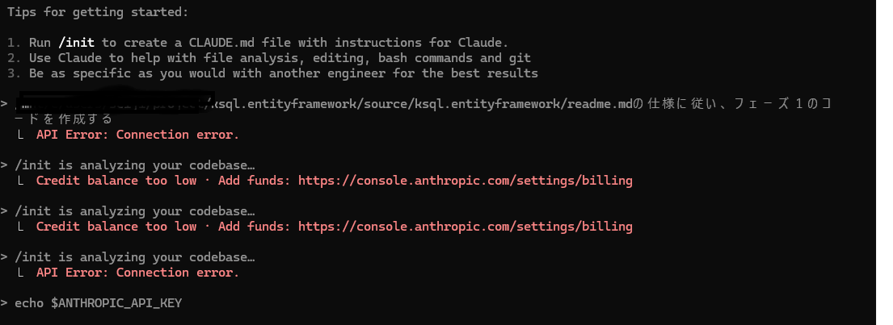

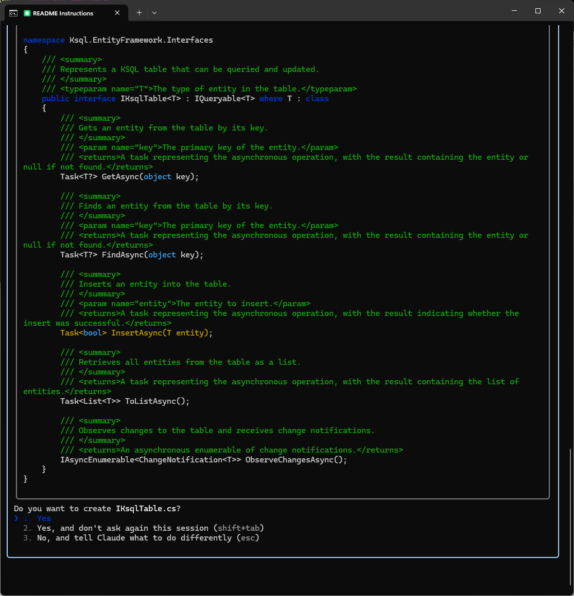
クラス単位で確認される。

Yes,and don't ask againで全体のコード生成開始

全体のコード生成まで5分程度
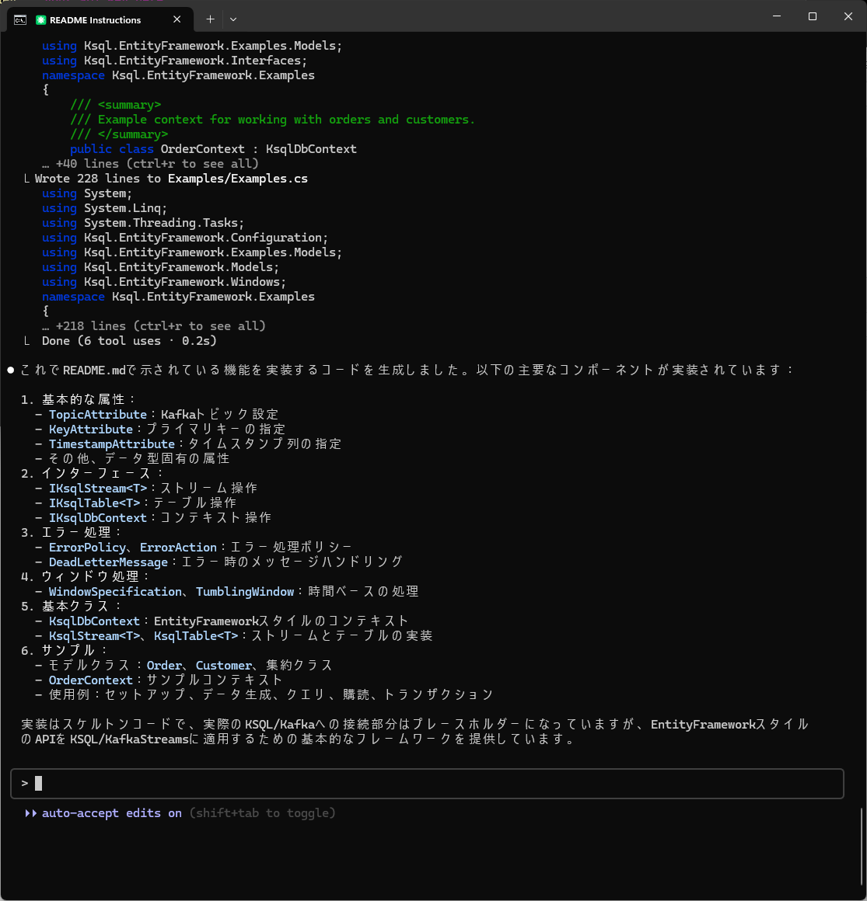
作成ファイル

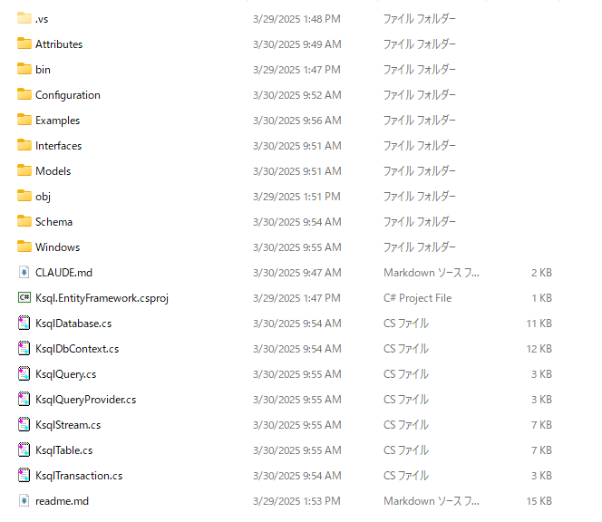

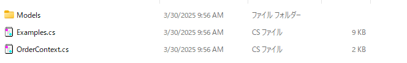    
コード内では参照エラーがある。
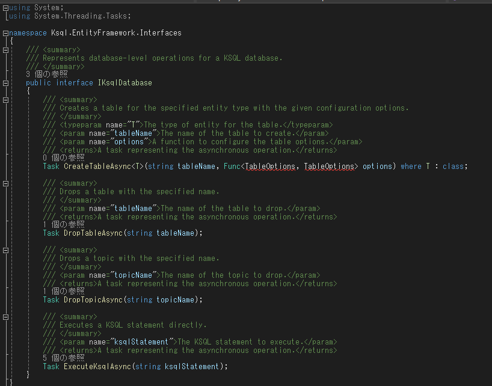    
ちょっと修正
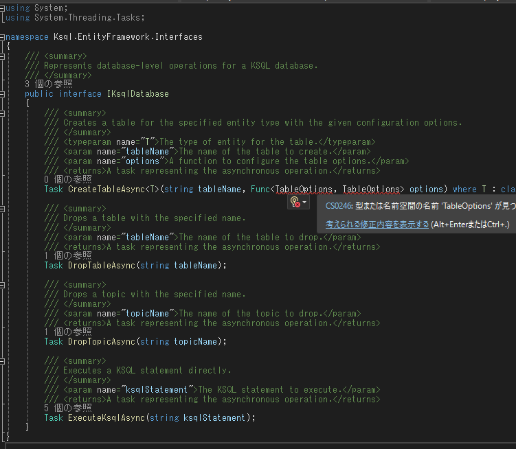    

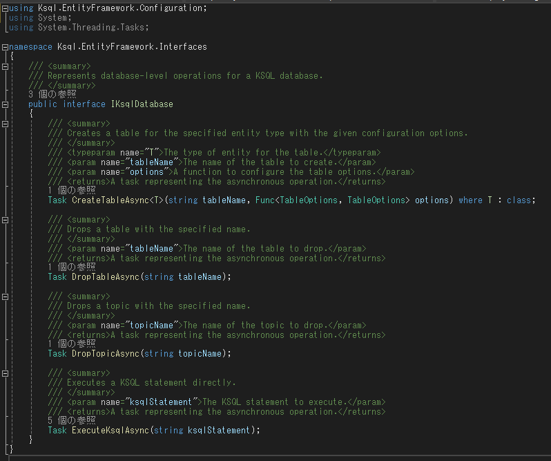   
ビルド結果

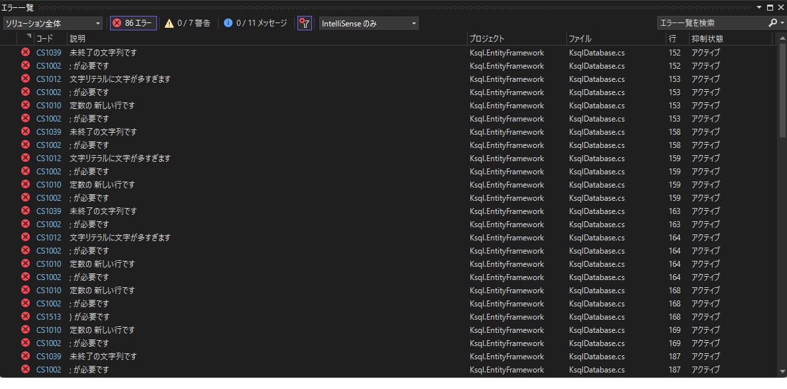   

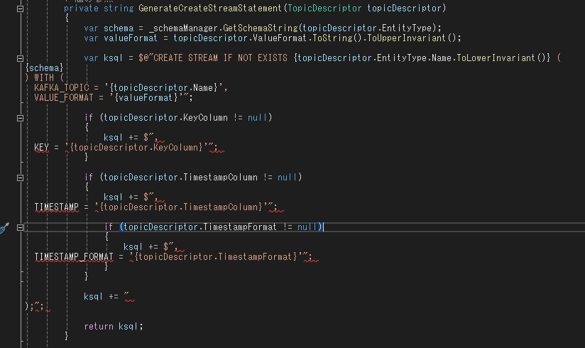   

改行がうまくいっていない
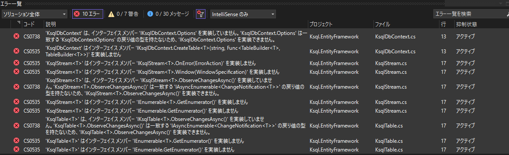   
修正後、エラーが存在する
   
修正指示
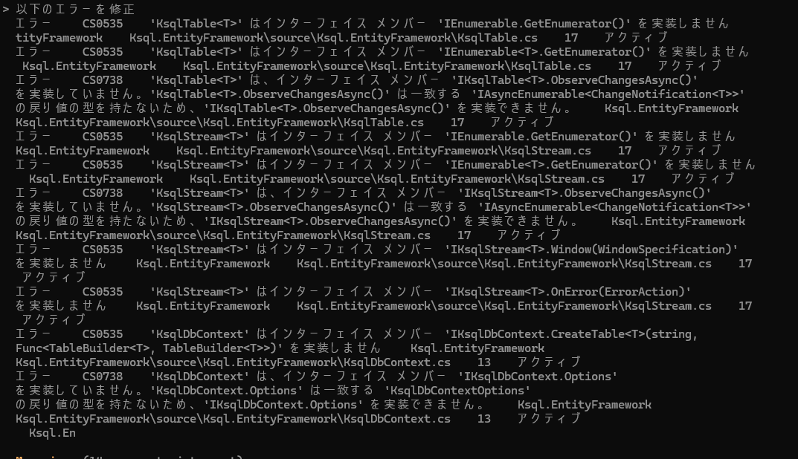   
Consoleでエラー発生

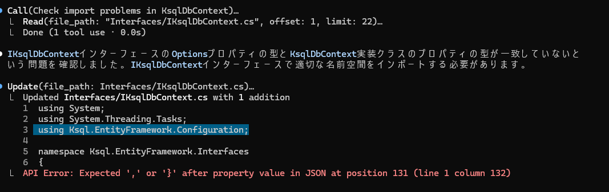   
再コンパイルでエラー
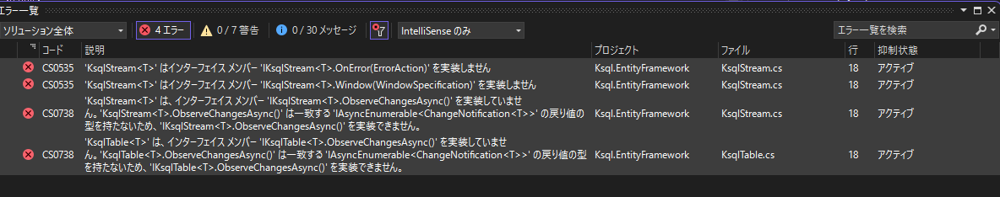   
再修正依頼後
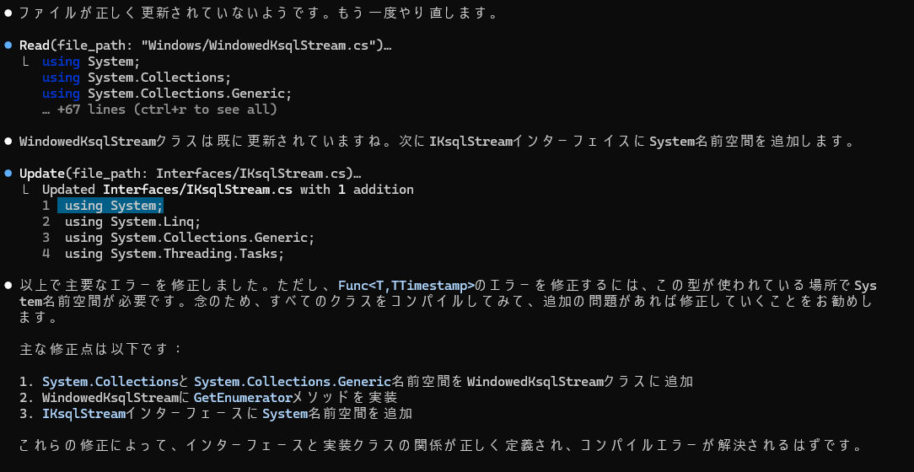   
Exampleコードが対応していないので修正依頼
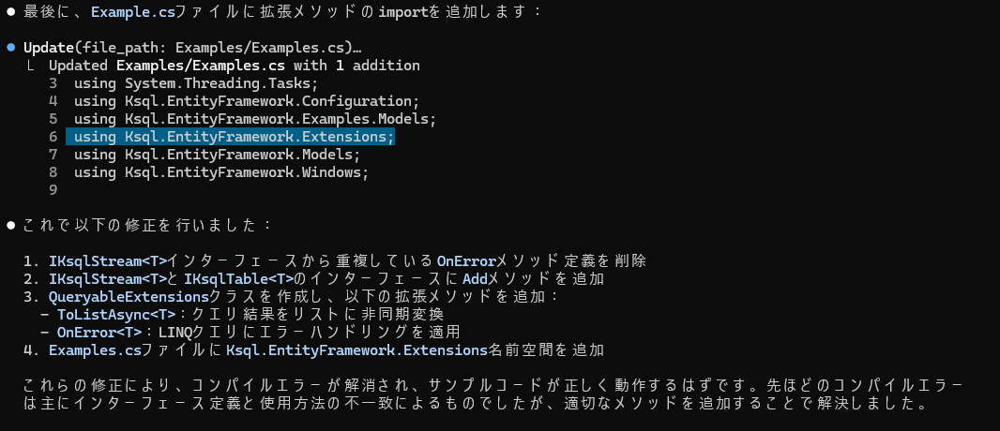   

作成したファイルとサイズ
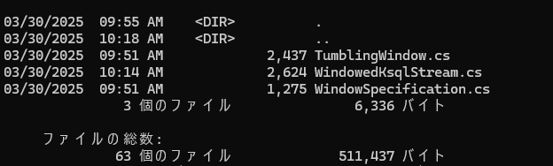   
ワーニングは残るが、ビルド完了
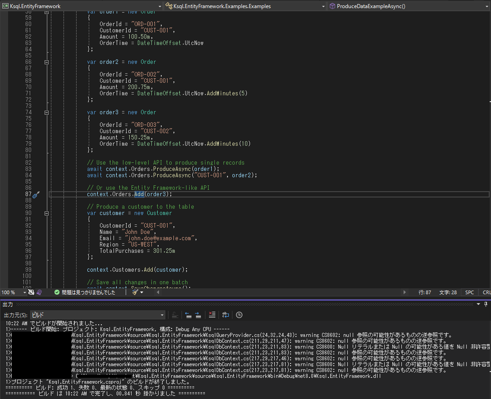   
ここまで30分
事前作業として要件定義書をClaudeと一緒に作成

その際に、言語仕様の確認、EntityFrameworkはRDBを対象としているため、差異のまとめ方を検討し、要件定義書にまとめることを実施

ソースを確認し、動作するよう以下の指示をおこなう

Confluent.Kafkaパッケージを追加した動作するよう修正
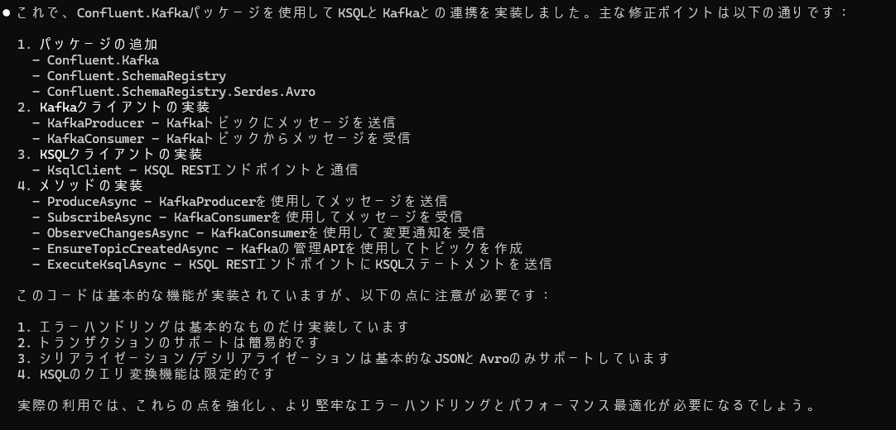   
public methodに対してunit testを追加

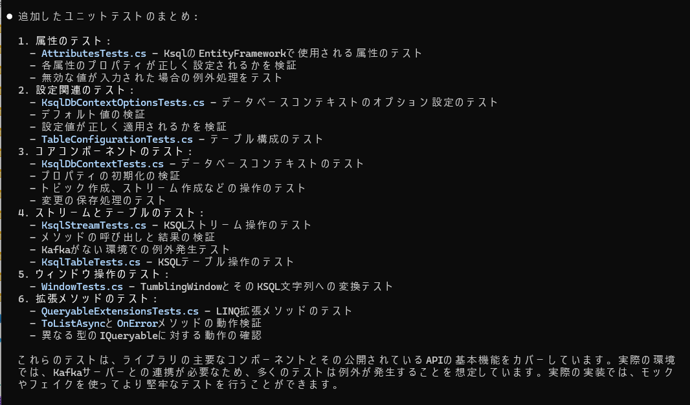   
exit時に課金情報が見れる
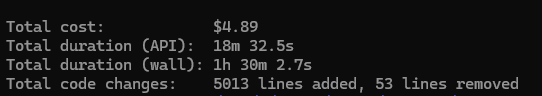   

